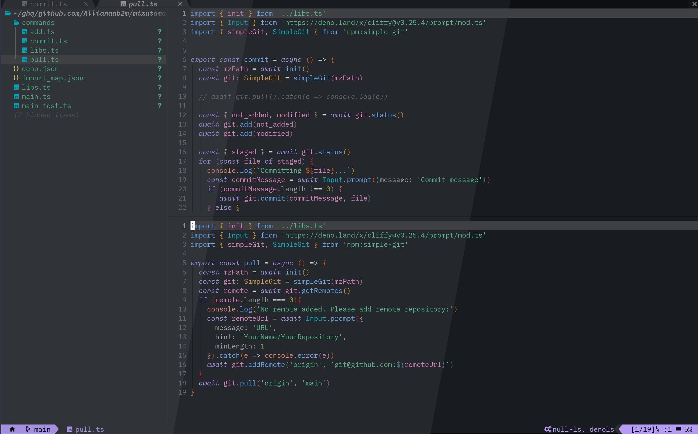

# 🌘 penumbra.nvim



Original color theme: [nealmckee/penumbra](https://github.com/nealmckee/penumbra)

As for the colorscheme loading logic, I referred to [dracula.nvim](https://github.com/Mofiqul/dracula.nvim) a great deal.
Thank you.

## Installing
```lua
require('packer').startup({function(use)
  use({
    'Allianaab2m/penumbra.nvim',
    config = function()
      require('penumbra').setup()
      vim.api.nvim_command('colorscheme penumbra')
    end
  })
end})
```

## Configs
```lua
{
  italic_comment = bool, -- default: false
  transparent_bg = bool, -- default: false
  show_end_of_buffer = bool, --default: false
  lualine_bg_color = '#RRGGBB', -- default: nil
  light = bool, -- default: false
  contrast = nil | 'plus' | 'plusplus' -- default: nil
  -- customize colors
  colors = {
    sun_p = '#FFFDFB',
    sun = '#FFF7ED',
    sun_m = '#F2E6D4',
    sky_p = '#BEBEBE',
    sky = '#8F8F8F',
    sky_m = '#636363',
    shade_p = '#3E4044',
    shade = '#303338',
    shade_m = '#24272B',

    red = '#CA736C',
    orange = '#BA823A',
    yellow = '#8D9741',
    green = '#47A477',
    cyan = '#00A2AF',
    blue = '#5794D0',
    purple = '#9481CC',
    magenta = '#BC73A4',
  },
  overrides = {
    -- example:
    -- NonText = { fg = '#RRGGBB' }
  },
}
```

## Support Plugins

- [nvim-treesitter](https://nvim-treesitter/nvim-treesitter)
- [Builtin LSP](https://neovim/nvim-lspconfig)
- [gitsigns.nvim](https://github.com/lewis6991/gitsigns.nvim)
- [telescope.nvim](https://github.com/nvim-telescope/telescope.nvim)
- [NvimTree](https://github.com/nvim-tree/nvim-tree.lua)
- [NeoTree](https://github.com/nvim-neo-tree/neo-tree.nvim)
- [Bufferline](https://github.com/akinsho/nvim-bufferline.lua)
- [LspSaga](https://github.com/glepnir/lspsaga.nvim)
- [IndentBlankline](https://github.com/lukas-reineke/indent-blankline.nvim)
- [nvim-cmp](https://github.com/hrsh7th/nvim-cmp)
